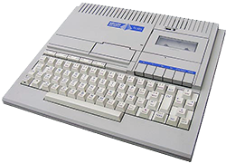
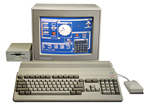

template: article.jade
title: Me, me and my Story

Mi chiamo Davide D'Agostino e sono nato il 9 novembre 1983 a Milano (Italia).

Mi sono appassionato alla programmazione all'età di 8 anni. Ho fatto di tutto per farmi regalare
da mio Zio il suo PC-128, e ho mosso i miei primi passi nella programmazione proprio col manuale
di Basic.

Il manuale su come programmare in _basic_ è stato il primo libro che ho letto e putroppo è stato
anche più difficile poiché non era scritto nella mia _lingua_, l'italiano bensì in inglese.

Questo è anche stato uno dei motivi per cui da sempre sono stato innamorato degli **Stati Uniti**.
Anche se all'epoca l'italiana Olivetti era leader nel settore già da piccolo capivo che questo
mondo si stava spostando nel continente americano.

Dopo di che a differenza dei miei amici che volevano il [commodore 64](http://en.wikipedia.org/wiki/Commodore_64)
io ero più interessato ad avere la mitica [amiga 500](http://en.wikipedia.org/wiki/Amiga_500)
che insieme al suo [workbench](http://en.wikipedia.org/wiki/Workbench_(AmigaOS)) reputavo essere
già iper rivoluzionario... molto di più di **Mac OS** o **Windows 3.11**

Dopo aver posseduto l'Amiga 500, 600 e 1200 ho iniziato a spostarmi verso i pc, dove ho inziato
creare qualcosa di più concreto.

I miei primi siti web; erano circa gli anni 90 quando la mia scuola media insieme ad una piccola
azienda locale decise di finanziare un progetto per creare una radio internet in parte fatta in
_multicast_ in parte in _broadcast_.

Fu uno dei primi esperimenti al mondo di contenuti **on demand** e le radio web così come le **tv**
col tempo: grazie anche alle linee più veloci; hanno raggiunto un grande successo.

Nel 2002 mi sono **diplomato** all'istituto tecnico commerciale [Gino Zappa](http://www.itczappa.it/wp3/chi-siamo-2/)
come _perito tecnico commerciale e programmatore_.

Purtroppo anche se in parte la mia nazione è stata pioniera nel settore informatico, man mano che
passavano gli anni tutto si spostava oltreoceano tanto che appunto era difficile ... se non impossibile,
trovare qui delle buone univeristà si scienze informatiche.

Così decisi di continuare come avevo sempre fatto, **autodidatta**.

Negli anni di superiori, sottraevo gran parte dello studio scolastico per imparare a programmare in:

* PHP
* .NET
* Java
* C, C++

Diciamo che il **php** era il mio coltellino svizzero per il web, in particolare avevo abbracciato
la moda dei forum [vbulletin](https://www.vbulletin.com). A malincuore dovevo ancora programmare
su _windows_ (nonostante il mio amore per linux: ero un [redhat](http://www.redhat.com) fan) e
quindi dovevo creare applicazioni desktop in visualbasic o C# poi... Java, anche se il supporto `gui`
non è mai stato il suo forte serviva al medesimo scopo, fingiamo quindi di dire che era `multipiattaforma`
dando per scontato che tutti sappiamo quanto era complicato cercare di creare qualcosa che si
vedesse decentemente su tutti gli `os`

Discorso diverso fu per **C/C++** e **Assembler**. Essi mi servirono (forse non dovrei dirlo) per
riprogrammare i carissimi **PIC** dei decoder ... oppure per creare piccole _ma non malevoli_
ignote applicazioni che diciamo hanno avuto l'onore di entrare nella lista di qualche noto antivirus.

## 1° Lavoro, 1 Anno alla IRPE come Commericale Software

Nel mentre mi arrivavano alcune richieste di lavoro, così accettai la prima proposta di lavoro come
**commericale software** al quella che un tempo era una grande ed importante multinazionale italiana,
la [IRPE](http://www.irpe.it) di __Varese__. Quello che a dir la verità mi spinse ad accettare il
lavoro, oltre che ovviamente il buon stipendio fu il fatto che furono i primi importatori dei
mitici **Apple** computers.

Fu un lavoro davvero bello, con clienti importantissimi quali il:

* [Governo Italiano](http://www.governo.it)
* [European Space Agency](http://www.esa.int/esaCP/index.html)
* [Sole 24 ore](http://www.ilsole24ore.com)

Devo davvero ringraziare persone come **Laura Baratella** per avermi formato, forgiato e cresciuto
in un ambiente lavorativo davvero tosto e competitivo. Grazie di cuore.

## 2° Lavoro, 2 Anni alla IRPE come Sistemista e Programmatore

Sempre nella IRPE successivamente mi fu proposto di inizare a collaborare con altri sviluppatori
Java a diversi progetti aziendali.

Questa fu la mia prima esperienza **reale** di lavoro in team... e in Italia.

## 3° Lavoro, 3 Anni alla Europ Assistance (Generali Group)

Nella IRPE economicamente le cose non andavano benissimo e proprio a causa delle acque agitate decisi
di cambiare e andare nella Europ Assistance come programmatore **.net** (ma vi prego non ditelo in giro)
su sistemi complessi di call center per clienti come:

* [Generali](http://www.generali.com)
* [BMW](http://www.bmw.com)
* [Comune di Milano](http://www.comune.milano.it)

## 4° Lavoro, 6 Anni alla LipsiaSOFT

Nel 2006 insieme ad un ragazzo conosciuto nei miei _forum_ (... vbulletin ricordate? :D) abbiamo
creato una grande impresa, una **web agency**.

Il motivo che mi ha spinto a ciò è presto detto, l'Italia nel nostro settore è molto molto indietro
e mentre nel mondo si affacciavano linguagi come [Ruby](http://www.ruby-lang.org) le nostre imprese
rimanevano saldamente ancorate alle vecchie tecnologie... fin quando si trattava di Java o PHP ciò
era anche sopportabile, ma quando nel 2005 si parlava ancora di [visual basic](http://en.wikipedia.org/wiki/Visual_Basic)
e di [asp.net](http://en.wikipedia.org/wiki/ASP.NET) ... tutto ciò mi rendeva molto triste sul mio
futuro di programmatore, programmatore amante di nuove tecnologie.

Formammo la società, forse una delle prime nel nostro paese ad usare esclusivamente gli
[Apple Computers](http://apple.com) e sicuramente la primissima ad utilizzare
[Ruby](http://www.ruby-lang.org) e ovviamente [Rails](http://rubyonrails.org).

Negli anni in [LipsiaSOFT](http://www.lipsiasoft.com) e dopo aver sviluppato diverse centinaia
di siti web (in parte visibili [qui](http://www.lipsiasoft.com/it/portfolio) e [qui](/pages/my-web-sites/))
ho iniziato a dare il mio contributo dapprima con diverse decine di plugins [Rails](http://rubyonrails.org)
tra cui:

* [LipsiADMIN](https://github.com/daddye/lipsiadmin)
* [Exception Notifiers](https://github.com/DAddYE/exception-notifier)
* [LightBOX](https://github.com/DAddYE/lightbox)

successivamente ho poco gradito il merge di [Merb](http://www.merbivore.com) e ho deciso insieme ad
altri ragazzi di sviluppare un buonissimo framework [Padrino](https://github.com/padrino/padrino-framework)
che sopperiva appunto all'uso esagerato in termini di **RAM** di Rails dando performance nettamente
più elevate, qualcosa intorno al 4x più veloce.

Maggiori riferimenti li potete trovare nella pagina [why](http://www.padrinorb.com/pages/why) e per
capire nel dettaglio cosa ho seguito io potete consultare [i miei progetti](http://localhost:3000/pages/projects/)

## Parentesi MISO

Grazie a Padrino Framework ho conosciuto uno dei miei migliori amici [Nathan Esquenazi](https://github.com/nesquena)
ho avuto modo di fare una fantastica esperienza finalmente in quella che considero la mia
patria: gli **Stati Uniti**.

Ho quindi lavorato per circa 1 mese come consulente programmatore in quella che 2 anni fa era una
startup [miso](http://gomiso.com) finanziata dai Google Venture Capitals.

Qui ho capito che il mio paese erano gli Stati Uniti, tanti programmatori, coding camp, bar camp,
conferenze etc...

San Francisco è la mia Città.

## Oggi

Oggi _2012-08-01_ ho ceduto tutte le mie quote **LipsiaSOFT** perché il mio sogno appunto è
ritornare a "casa".
